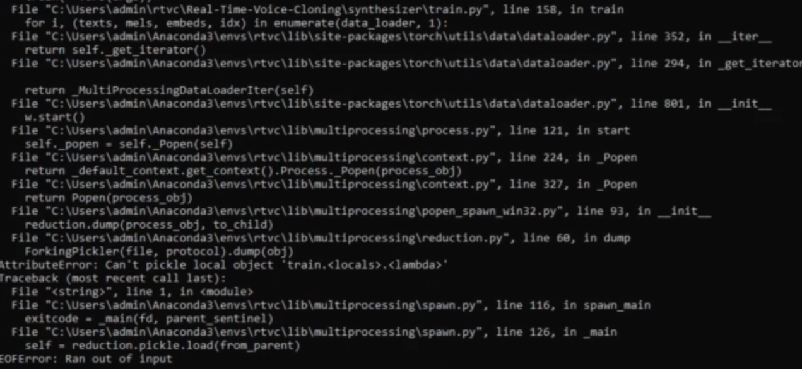

## under development ...

# voice_cloning

### Speech training data: 
https://www.caito.de/2019/01/03/the-m-ailabs-speech-dataset/

### Used projects:
* https://github.com/CorentinJ/Real-Time-Voice-Cloning
* https://github.com/padmalcom/Real-Time-Voice-Cloning-German

Adapted here for Linux/Ubuntu and updated to newer versions for some packages.

### Installation:

1. Download dataset in corresponding language from https://www.caito.de/2019/01/03/the-m-ailabs-speech-dataset/, 
decompress and save it in `voice_cloning/datasets`. 
2. In `install_voice_cloning.sh` script 
adapt the `Pytorch` version to own CUDA or ROCM
version, see here for [latest version](https://pytorch.org/) in section "INSTALL PYTORCH". For older versions see 
[here](https://pytorch.org/get-started/previous-versions/).
3. Run the `install_voice_cloning.sh` script. 

### Manual installation:

If using ROCm the version can be checked by:
```
apt show rocm-libs -a
```

Install environment:

```bash
conda env create --file linux_64_environment.yml -n voice_cloning
conda activate voice_cloning

# adapt to own CUDA or ROCM version, see https://pytorch.org/ or for 
# previous versions see https://pytorch.org/get-started/previous-versions/
pip3 install torch torchvision torchaudio --index-url https://download.pytorch.org/whl/rocm5.4.2
```

Check installed PyTorch version:
```
python -c "import torch; print(torch.__version__)"
```

Testing the PyTorch installation (see https://rocm.docs.amd.com/projects/install-on-linux/en/latest/how-to/3rd-party/pytorch-install.html).
Import the torch package in Python to test if PyTorch is installed and accessible:
```
python3 -c 'import torch' 2> /dev/null && echo 'Success' || echo 'Failure'
```

Check if the GPU is accessible from PyTorch. In the PyTorch framework, 
`torch.cuda` is a generic way to access the GPU. This can only access an AMD GPU if 
one is available.:
```
python3 -c 'import torch; print(torch.cuda.is_available())'
```

### Update environment file (linux):
```bash
conda env export --no-builds -n voice_cloning > linux_64_environment.yml
```

### Voice cloning:

1. run M-AI-Lab text normalization:
    ```
    python mailab_normalize_text.py --datasets_root datasets/de_DE
    ```
   Note: don't split double quotes over multiple text fragments in different audio files. 
   In this case surround each of the text snippets for each sound file with double quotes.
2. Encoder prepocessing:
    ```
    python encoder_preprocess.py datasets/
    ```
   NOTE: on `audioread.exceptions.NoBackendError` look above in error messages, there is a 
   file failed with an error message on opening file. This happens due to a broken wav file, for example: 
   
   
   remove the broken file `datasets/de_DE/by_book/female/ramona_deininger/tom_sawyer/wavs/._tom_sawyer_09_f000196.wav` and 
   every file which induce the same error in the downloaded data sets.

3. Encoder training:
    ```
    python encoder_train.py <name of training run, e.g. encoder_de> datasets/SV2TTS/encoder --no_visdom
    ```
   Alternatively use a visdom server. For this start another shell, activate the
   voice_cloning conda environment there and run the server by typing the command 
   `visdom`. The server will start at localhost:8097.
   In your first conda environment now the command without --no_visdom should be used:
    ```
    python encoder_train.py <name of training run, e.g. encoder_de> datasets/SV2TTS/encoder
    ```
   Use the server URL given by second conda env shell (https://localhost:8097). Select
   in web interface in `Environment` drop down in top bar the name of the encoder 
   training run and deselect "main". Now visualizations of the training appear after a 
   while:
   
   
   The model will be saved in `saved_models` directory.

4. Synthesizer preprocessing:
   Run the synthesizer preprocessing:
   ```
   python synthesizer_preprocess_audio.py datasets/ --subfolders de_DE/by_book/female,de_DE/by_book/male,de_DE/by_book/mix --dataset "" --no_alignments --wav_dir
   ```
   And embed the model from encoding:
   ```
   python synthesizer_preprocess_embeds.py datasets/SV2TTS/synthesizer --encoder_model_fpath saved_models/mini_encoder_de/encoder.pt
   ```
5. Synthesizer training:
   
   ```
   python synthesizer_train.py <name of training run, e.g. synthesizer_de> datasets/SV2TTS/synthesizer
   ``` 
   
   If this error occur ("EOFError: Ran out of input"):

   
   
   change in line 179 of script `synthesizer/train.py` the number of workers from 2 to 0: `num_workers=0`.

6. Vocoder preprocessing:
   Create the `vocoder` folder in `datasets/SV2TTS` and start the preprocessing:
   
   ```
   mkdir -p datasets/SV2TTS/vocoder
   python vocoder_preprocess.py datasets --model_dir=synthesizer/saved_models/synthesizer_de
   ```

8. Vocoder training:
   Start training by using for example `vocoder_de` as model name and 
   adding the path to the datasets
   ```
   python vocoder_train.py <name of training run, e.g. vocoder_de> datasets
   ```
   After training the model is located in: `vocoder/saved_models/vocoder_de`. In the
   `wav` folder are pairs of .wav files: one with `_target.wav` suffix which is the original
   sound file and one with `_gen_batched_target8000_overlap400.wav` suffix which is the
   generated sound  file.
9. v

