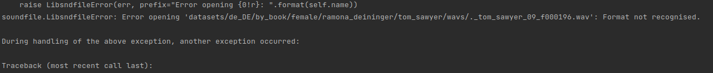
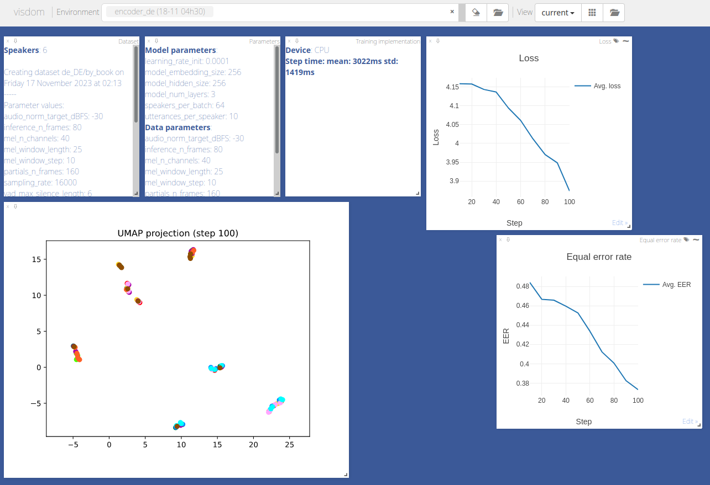

# voice_cloning

### Speech training data: 
https://www.caito.de/2019/01/03/the-m-ailabs-speech-dataset/

### Used projects:
* https://github.com/CorentinJ/Real-Time-Voice-Cloning
* https://github.com/padmalcom/Real-Time-Voice-Cloning-German

Adapted here for Linux/Ubuntu usage and updated to newer versions for some packages.

### Installation:

1. Download dataset in corresponding language from https://www.caito.de/2019/01/03/the-m-ailabs-speech-dataset/, 
decompress and save it in `voice_cloning/datasets`. 
2. In `install_voice_cloning.sh` script 
adapt the `Pytorch` version to own CUDA or ROCM
version, see here for [latest version](https://pytorch.org/) in section "INSTALL PYTORCH". For older versions see 
[here](https://pytorch.org/get-started/previous-versions/).
3. Run the `install_voice_cloning.sh` script. 
 
### Manual installation:
```bash
conda env create --file linux_64_environment.yml -n voice_cloning
conda activate voice_cloning

# adapt to own CUDA or ROCM version, see https://pytorch.org/ or for 
# previous versions see https://pytorch.org/get-started/previous-versions/
pip3 install torch torchvision torchaudio --index-url https://download.pytorch.org/whl/rocm5.4.2
```

### Update environment file (linux):
```bash
conda env export --no-builds -n voice_cloning > linux_64_environment.yml
```

### Voice cloning:

1. run M-AI-Lab text normalization:
    ```
    python mailab_normalize_text.py
    ```
2. Encoder prepocessing:
    ```
    python encoder_preprocess.py datasets/
    ```
   NOTE: on `audioread.exceptions.NoBackendError` look above in error messages, there is a 
   file failed with an error message on opening file. This happens due to a broken wav file, for example: 
   
   
   remove the broken file `datasets/de_DE/by_book/female/ramona_deininger/tom_sawyer/wavs/._tom_sawyer_09_f000196.wav` and 
   every file which induce the same error in the downloaded data sets.

3. Encoder training:
    ```
    python encoder_train.py <name of training run> datasets/SV2TTS/encoder --no_visdom
    ```
   Alternatively use a visdom server. For this start another shell, activate the
   voice_cloning conda environment there and run the server by typing the command 
   `visdom`. The server will start at localhost:8097.
   In your first conda environment now the command without --no_visdom should be used:
    ```
    python encoder_train.py <name of training run> datasets/SV2TTS/encoder
    ```
   Use the server URL given by second conda env shell (https://localhost:8097). Select
   in web interface in `Environment` drop down in top bar the name of the encoder 
   training run and deselect "main". Now visualizations of the training appear after a 
   while:
   
   
   The model will be saved in `saved_models` directory.
4. 

